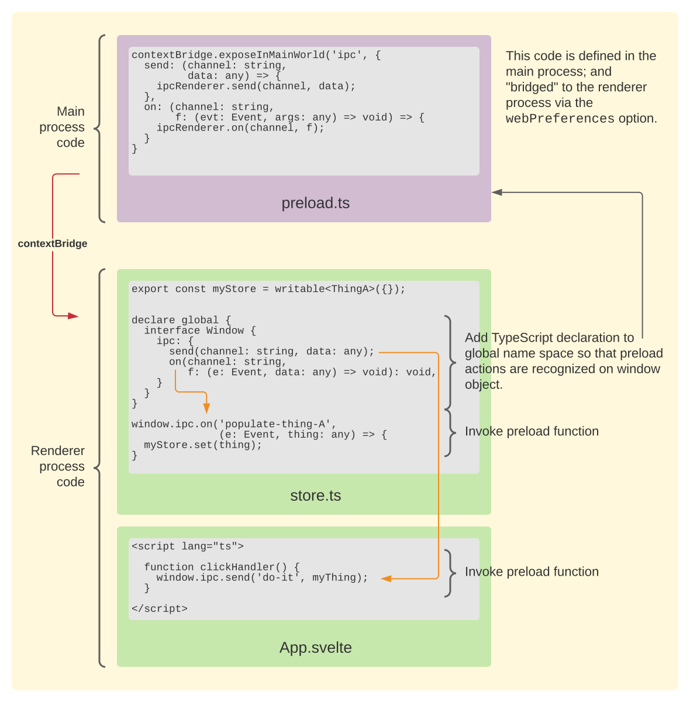

# ETS - Electron, TypeScript and Svelte


Contents

* [Getting Started](#getting-started)
* [Project Structure](#project-structure)
* [FAQ](#faq)
* [Creating New Windows](#new-window)
* [Logger](#logger)
* [electron-builder](#electron-builder)

This is a *starting point* repository for Electron applications that
integrate the following:

* [TypeScript](https://www.typescriptlang.org/) – A type-safety system
  on top of JavaScript
* [Svelte](https://svelte.dev/) – Web UI Framework
* [Electron Context Isolation](https://www.electronjs.org/docs/tutorial/security#3-enable-context-isolation-for-remote-content) - The latest
  security practices incorporated into Electron.

| Package | Version   |
|---------|-----------|
|Electron | **19.0.6**  |
|Svelte   | **3.48.0**  |

Check the
[new Electron release cadence](https://www.electronjs.org/blog/8-week-cadence)
for information on updating to new releases.

Many articles on the web purport to explain how to combine
Svelte, Electron and TypeScript.   One usually ends up with a
*hello world* screen that can not be easily extended
and nor run well in Electron 12 (which
[changed the `nodeIntegration` default in favor of `contextIsolation`](https://github.com/electron/electron/issues/23506)).

If you do **not** intend to load remote content in your renderer
processes, then this approach may be overkill for you.  You can
probably follow other "getting-started" tutorials that do a better
job of configuring hot-replacment and just remember to add

```
nodeIntegration: true
contextIsolation: false
```

to your web preferences.


## Getting Started

Use [degit](https://www.npmjs.com/package/degit) rather than
`git clone` to skim the latest version of this repository
and get started with your own repository.

1. Copy code.
   ```
   npx degit https://github.com/pglezen/electron-typescript-svelte-starter.git myapp
   ```

2. Change to `myapp` directory.

   ```
   cd myapp
   ```

3. Install dependencies.

   ```
   npm install
   ```

4. Compile main process components.

   ```
   npm run build:main
   ```

5. Compile main window compoments.

   ```
   npm run build:ui
   ```

6. Run application.

   ```
   npm run start
   ```

## Project Structure

* `build` - Used for build-time artifacts like icons.

* `deploy` – Used by [electron-builder](https://www.electron.build/)
  for distributing the final executable.  Note that electron-builder
  uses `dist` by default.  This has to be changed in the build
  configuration.

* `dist` - Main process files go here.  Files for supporting
  render processes go in subdirectories.  This is a transpiling
  target for TypeScript and Svelte.

* `dist/mainWindow` – The renderer process of the main window.

* `dist/logsWindow` - The renderer process of the logger window.

* `src/sometypes.d.ts` – a type definition file for use by the project.

* `src/main` – TypeScript source for the main processes.

* `src/UI` – Svelte source code for the renderer process
  using `lang="ts"` to support TypeScript.  For each subdirectory `xxxx`
  of this folder there should be a
  * `dist/xxxxWindow` folder
  * a `buildWindow('xxxx')` entry in the exported array at the bottom of `rollup.config.js`.


## FAQ

### Why two `tsconfig` files?

I had trouble combining the TypeScript configuration between the Svelte
files and the Electron files.  So I created two:

* `tsconfig-main.json` – Electron main process.
* `tsconfig-ui.json` – Electron renderer processes.

Each one is referenced from its build.  The **main** build uses the
`--project` option of the `tsc` command to reference `tsconfig-main.json`
and compile its files (in `src/main`) to the the `dist` directory.
The Svelte components are processed through Rollup.  In Rollup,
TypeScript processing is configured through the `@rollup/plugin-typescript`
entry in `rollup.config.js`.

```js
  typescript({
    tsconfig: 'tsconfig-ui.json',
    sourceMap: !production,
    inlineSources: !production,
  }),
```

### Why Preload?

For renderers with `contextIsolation = true`, neither the Node.js nor the
Electron components which leverage Node.js are available to the renderer
processes; not even `ipcRenderer`, which is generally regarded as the bare
minimum.  The "loophole" is a `preload.js` script (configured in
`webPreferences`) that determines exactly what is allowed by

1. Importing/Creating it,
2. Passing it to `contextBridge.exposeInMainWorld`.

The [contextBridge](https://www.electronjs.org/docs/api/context-bridge) will
ensure that these items (and only these items) are available to renderer processes
via the `window` object.  **If you try to assign directly to the `window` object
from within the `preload.js`, it will be gone by the time the renderer loads.**

There is a whole range of techniques for configuring the ContextBridge.
[This StackOverflow anwser](https://stackoverflow.com/a/59888788/1525101) is
what schooled me.  It specifies exactly what the renderer can do and nothing
more.  It's air tight; but it requires one to individually catalog each message.
The approach I've taken is a bit more relaxed, using a generic `send` and `on`
methods of an `ipc` member, to be added to the `window` global context of the
render.



The diagram above illustates how to interweave the context bridge
definitions with the global namespace TypeScript declarations.

* The `preload.js` script (shown at the top) is defined in the
  main process.  It is passed to the `webPreferences` option for
  a new `BrowserWindow` instance.

* The new renderer process has the `send` and `on` functions
  available to it on the `window` object as attributes of an
  `ipc` object (i.e. `window.ipc.send` and `window.ipc.on`).

* A TypeScript compiler will mark these functions as **undefined**.
  To inform the TypeScript compiler of their existence, a
  `declare global` statement is added to declare the existence of
  these functions on the `window.ipc` scope.  This makes it
  to all the Svelte code files that import the store.

The context bridge action is indicated with red arrow.  The
affect of the TypeScript `global declare` is indicated with
the orange arrows.

### Why no dynamic updates?

I'm just not good enough at this stuff, yet.  For now, I recompile
the main process each time I change electron code.  For the renderers,
I run `npm run dev` that dynamically recompiles the renderer TypeScript.
But the renderer window still requires a manual refresh (ctrl/cmd-R).
I'm not sure if `rollup-plugin-livereload` knows how to deal with an
Electron renderer.

## New Window

Here are the steps for creating a new window.

1. Create a new subdirectory of `dist` named `xxxxWindow` where
   `xxxx` is some prefix that identifies your window.  We'll be using
   `xxxx` as a prefix for several other artifacts.

2. Copy the `index.html` from the `dist/mainWindow` directory into `dist/xxxxWindow`.
   Change the `<title>` and script references as appropriate.  Leave the
   references to `./bundle.css` and `./bundle.js`.

3. Create a `xxxx` subdirectory of `src/UI`.  Copy `src/UI/main/index.ts`
   into this new directory.  This will be your window's entry point.

4. Add your Svelte code to this directory.  Reference your `*.svelte`
   component from `index.ts`.

5. (Optional) Add a custom `xxxxPreload.js` script to `src/main` if you
   wish to customize what is exposed to this window.  This might be desirable
   if this window loads external content or scripts.  Otherwise using
   the `preload.js` used by the main window is fine.

6. Edit `rollup.config.js`.  Add a new call to `buildWindow` for your new
   window.  For example:

   ```js
   export default [
     buildWindow('main', true),
     buildWindow('logs'),
     buildWindow('xxxx'),
   ]
   ```

   Omitting the second parameter (default `false`) avoids running multiple
   instances of the test server.  Only the main window should run the test
   server.

You won't see this window until you load it from your main process.

## Logger

A logging component is included both as a useful utility and as a
demonstration of creating a new window with its own *preload* script.

The `console.log` output from a renderer process is available from
the `BrowserWindow` debugger.  The main process output is available
from the CLI *when the application is run from the CLI*.  But this
is not the case when run as an application.  This component creates
a window that application users can open and use to report back to
the application developer events about the main process.

## electron-builder

The `package.json` has a `build` section for running
[electron-builder](https://www.electron.build/).  I didn't add it
to this project's dependency list because many people prefer to install
it globally.  If you do not wish to use electon-builder, simply
disregard or remove the `build` section from `package.json`.

Note that this project's build configuration overrides the default
output directory to be `deploy` instead of `dist`, since `dist` is
already being used for the transpilation target.  The `dist` directory
is the **source** for electron-builder.
